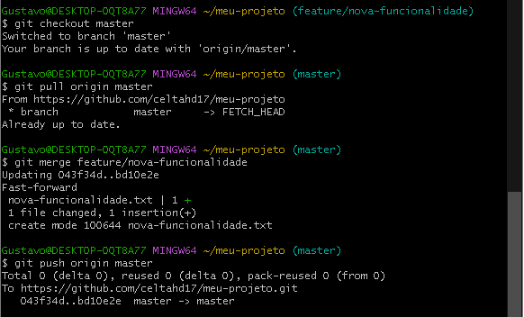

1 Configuração do GIT

2 Criação do REPO/ Inicialização e criação do arquivo READMI.md

3 Arquivos e Commit

4 GITHUB

https://github.com/celtahd17/meu-projeto

5 Conexão entre git e GitHub via token

6 Criação da nova branch

7 Merge da Branch

